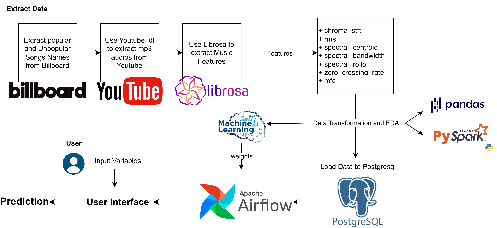
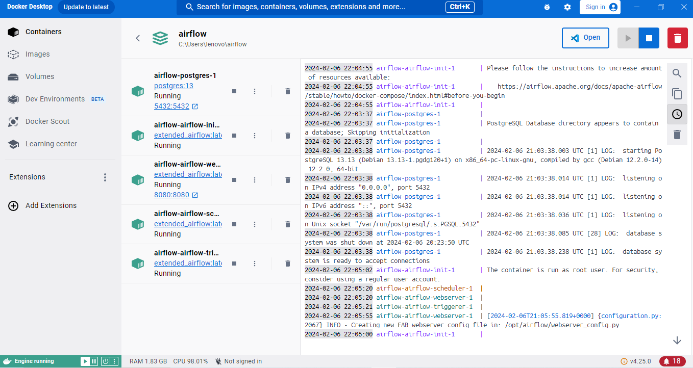
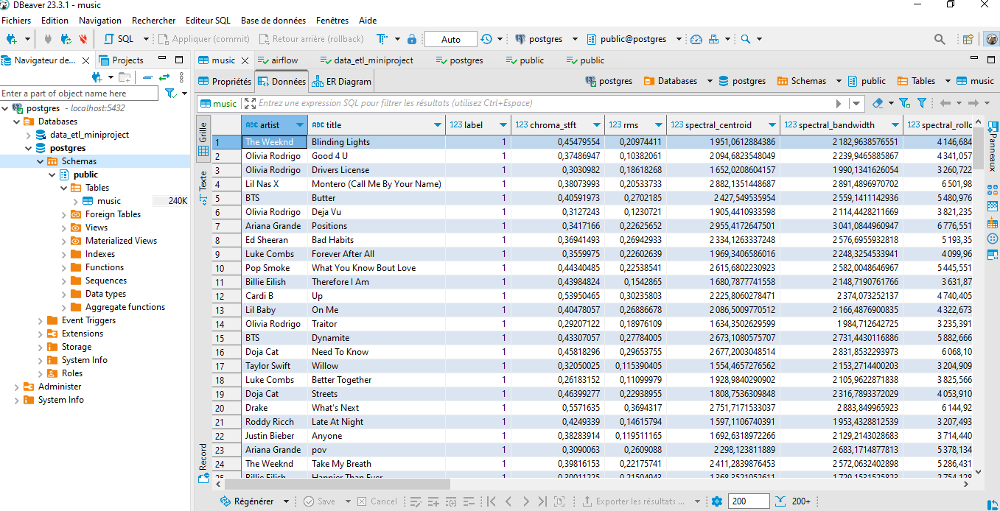
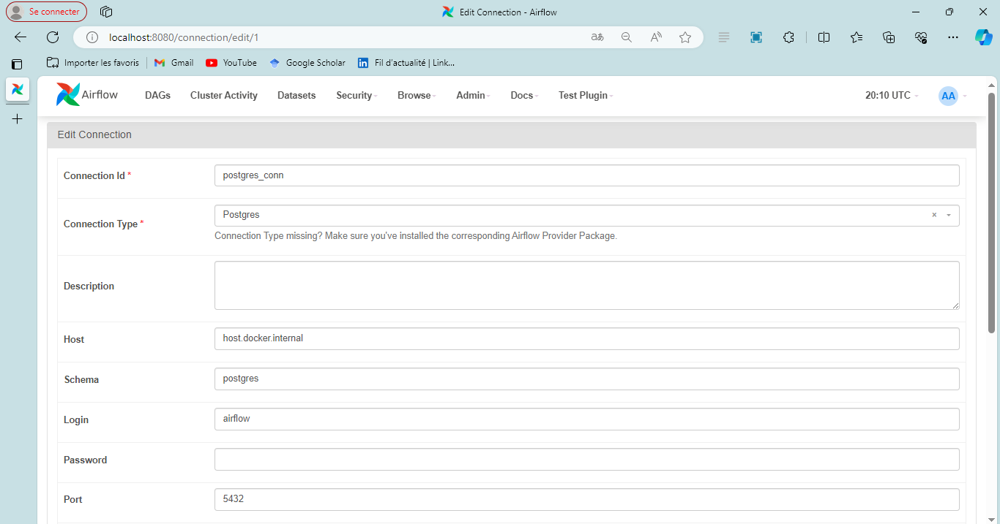
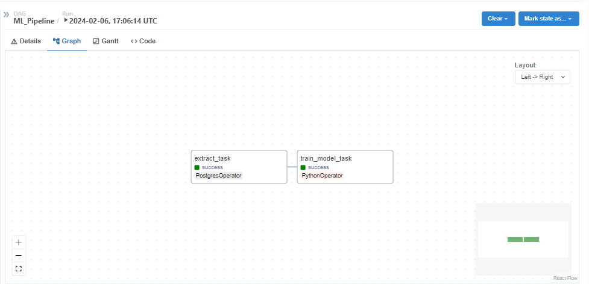
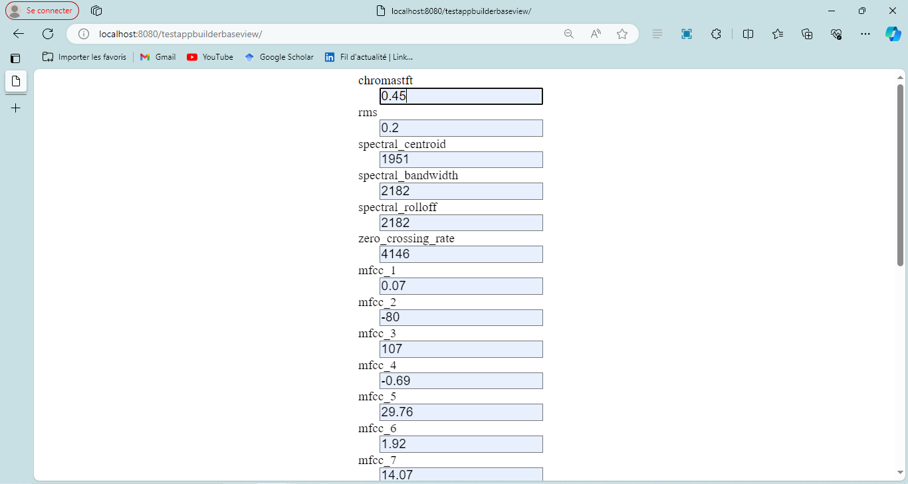
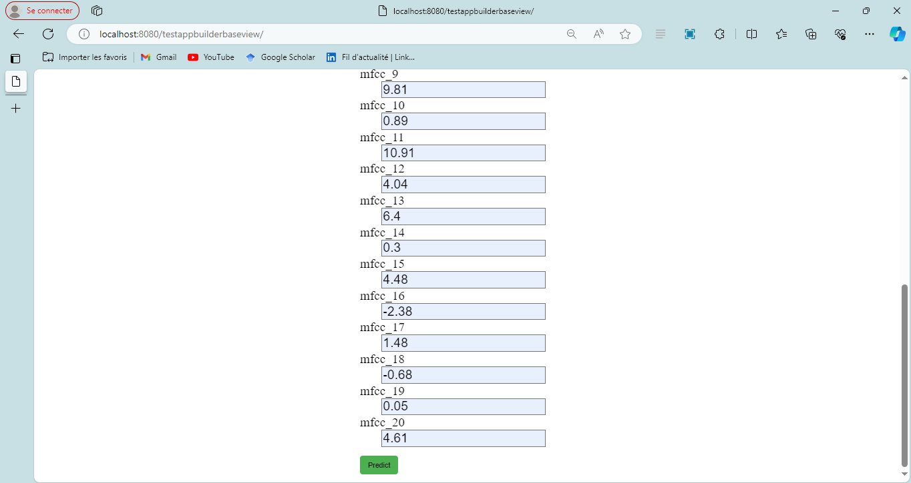
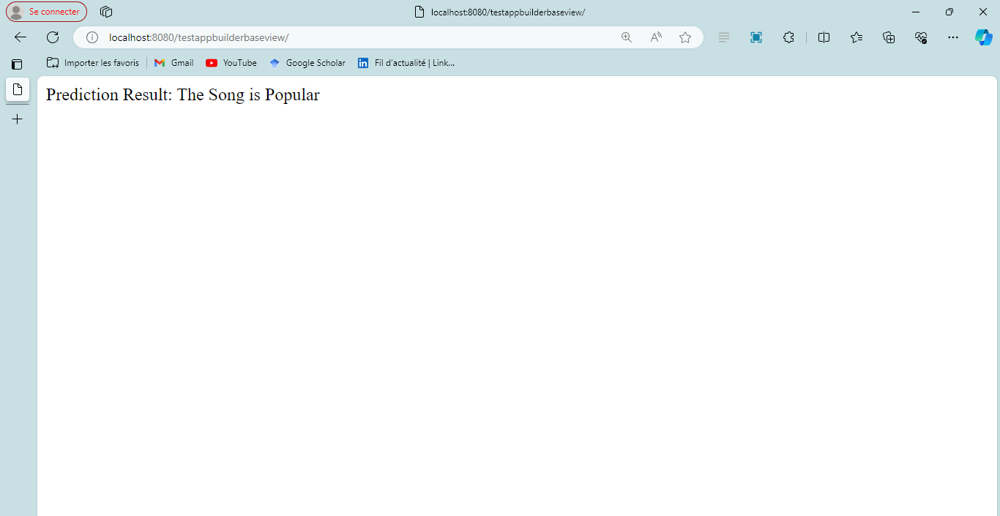

# ETL-Billboard-Music-Popularity-Analytics

## Project Overview

This project aims to analyze the popularity of songs using data collected from the Billboard API. The project follows an ETL (Extract, Transform, Load) workflow to gather, process, and analyze music-related data.



### Collect Data from Billboard

The `Task1_Collect_From_Billboard.ipynb` notebook, designed to collect data using the Billboard API. The resulting `Billboard.csv` file contains information about songs, including the artist, title, and a label indicating whether the song is popular or unpopular.

### Download Songs and Extract Music Features

In this phase, we utilize the `Billboard.csv` file and `youtube_dl` to download the MP3 files of songs. Two folders, "Songs" and "Unpopular," will be created. The "Songs" folder contains MP3 files of popular songs, while the "Unpopular" folder contains the ones deemed unpopular. The `DataWithMusic.csv` file will store the paths of every music file, accessed by Librosa to extract features from songs. The `Final_dataset.csv` file contains music features such as chroma_stft, rms, spectral_centroid, spectral_bandwidth, spectral_rolloff, zero_crossing_rate, and 20 columns of mfcc features.

### Exploratory Data Analysis

The `Task3_EDA_Billboard.ipynb` notebook covers exploratory data analysis and the training task of the data using the XGBoost algorithm. While you have the flexibility to try different algorithms like KNN/SVM, in this project, we focus on XGBoost for its suitability. Note that this is not an ML-centric project.

### Docker and Docker-Compose

1. Build the Docker image:
    ```bash
    docker build -t airflow .
    ```

2. Start the Docker containers with Docker Compose:
    ```bash
    docker-compose up
    ```


### Uploading Data to PostgreSQL Database

1. Make sure you have PostgreSQL installed and running.
2. Use your preferred database management tool (e.g., pgAdmin4 or DBeaver) to create a new database for this project and set Airflow as the owner.
3. Connect to your PostgreSQL instance and execute this SQL script to create the table
   
```sql
-- SQL script to create the music table
CREATE TABLE music (
    artist VARCHAR(255),
    title VARCHAR(255),
    label INT,
    chroma_stft FLOAT,
    rms FLOAT,
    spectral_centroid FLOAT,
    spectral_bandwidth FLOAT,
    spectral_rolloff FLOAT,
    zero_crossing_rate FLOAT,
    mfcc1 FLOAT,
    mfcc2 FLOAT,
    mfcc3 FLOAT,
    mfcc4 FLOAT,
    mfcc5 FLOAT,
    mfcc6 FLOAT,
    mfcc7 FLOAT,
    mfcc8 FLOAT,
    mfcc9 FLOAT,
    mfcc10 FLOAT,
    mfcc11 FLOAT,
    mfcc12 FLOAT,
    mfcc13 FLOAT,
    mfcc14 FLOAT,
    mfcc15 FLOAT,
    mfcc16 FLOAT,
    mfcc17 FLOAT,
    mfcc18 FLOAT,
    mfcc19 FLOAT,
    mfcc20 FLOAT
);
```


### Airflow DAG
You can find the training DAG, train_dag.py, in the 'dags' folder. It consists of two tasks: 'extract_task,' which extracts data from the PostgreSQL database, and 'train_model_task,' which trains the data using XGBoost and saves the 'model.pkl' file for later use in predictions.

Before triggering the DAG, it is necessary to create a database connection in Airflow to enable connection to PostgreSQL:


After establishing the database connection, you can trigger the DAG, and it will complete successfully:


### Predictions Based on User-Entered Data

In this section, we have built an Airflow plugin using Flask and AppBuilder that offers a custom view for conducting predictions through a form. The Python code and template code for this feature are located in the 'plugins' folder. Users can input variables and obtain results indicating whether the song is considered popular or unpopular.






